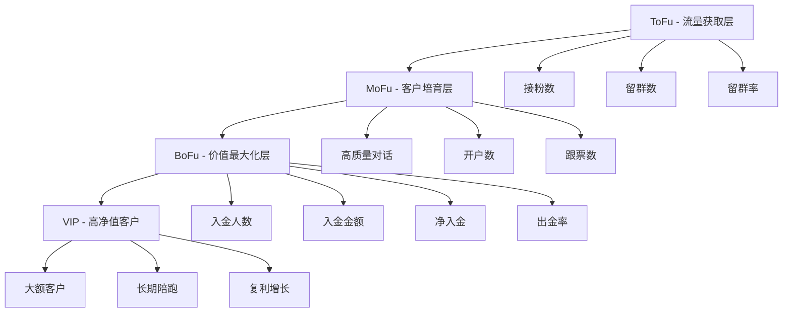
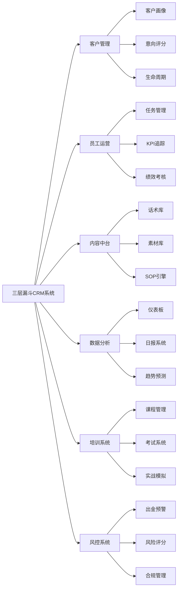

# 产品需求文档 (PRD) - 三层漏斗CRM系统

## 1. 产品概述

### 1.1 产品定位

三层漏斗CRM系统是一个专为私域运营团队设计的企业级客户关系管理与运营自动化平台。系统基于 **ToFu（引流层）→ MoFu（培育层）→ BoFu（转化层）** 的三层漏斗增长模型，帮助团队实现：

- 📊 **数据驱动决策**：实时可视化业务数据
- 🤖 **流程自动化**：SOP引擎自动推荐下一步动作
- 👥 **团队标准化**：统一话术、素材、培训体系
- 📈 **可复制增长**：新人7天上手，30天产出

### 1.2 核心价值

| 价值维度 | 传统方式 | 使用系统后 |
|---------|---------|-----------|
| 新人培训 | 30-90天 | 7-14天 |
| 数据统计 | 手工Excel，易出错 | 自动化，实时准确 |
| 客户管理 | 微信聊天记录，难追溯 | 完整画像+旅程追踪 |
| 决策依据 | 凭经验和感觉 | 数据+AI推荐 |
| 团队协作 | 各自为战 | 标准化流程 |

### 1.3 目标用户

#### 主要用户角色

1. **管理者/CEO**
   - 需求：全局数据监控、团队绩效管理、战略决策支持
   - 使用场景：查看仪表板、审阅报表、制定目标

2. **主管/Team Leader**
   - 需求：团队管理、员工培训、流程优化
   - 使用场景：带教新人、复盘会议、分配任务

3. **客户经理/运营专员**
   - 需求：客户管理、话术支持、任务执行
   - 使用场景：日常沟通、记录数据、完成KPI

4. **培训师**
   - 需求：课程管理、考核评分、进度追踪
   - 使用场景：新人培训、实战模拟、能力评估

5. **数据分析师**
   - 需求：数据分析、趋势预测、风险监控
   - 使用场景：生成报告、优化模型、预警管理

## 2. 业务模型

### 2.1 三层漏斗模型



### 2.2 客户生命周期 (CLM)

客户从陌生到VIP的完整旅程：

1. **Awareness** - 看到内容
2. **Attention** - 对你有兴趣
3. **Trust** - 开始信任
4. **Engage** - 产生粘度
5. **Action** - 完成开户
6. **Subscribe** - 首次入金
7. **Growth** - 复投增长
8. **Loyal** - 高净值客户
9. **Advocate** - 推荐他人

### 2.3 核心业务流程

#### ToFu 流程
```
素材发布 → 吸引粉丝 → 建群引导 → 初步筛选 → 标签分类 → 进入MoFu
```

#### MoFu 流程
```
聊天互动 → 意向评分 → 粘度建立 → 框架输出 → 引导开户 → 进入BoFu
```

#### BoFu 流程
```
开户完成 → 首金引导 → 持续入金 → 大额服务 → VIP维护 → 长期留存
```

## 3. 核心功能模块

### 3.1 功能架构图



### 3.2 九大核心模块

#### 模块1: 客户增长漏斗系统
- ToFu数据管理（接粉、留群、渠道分析）
- MoFu转化追踪（意向评分、粘度指数）
- BoFu业绩管理（入金、出金、净入金）
- 自动化流转（客户阶段自动升级/降级）

#### 模块2: CRM客户管理系统
- 360度客户画像
- 智能标签系统
- 意向信号评分（30项指标）
- 客户旅程可视化
- 聊天记录管理
- 下一步动作推荐

#### 模块3: 话术与素材库
- 12大模型话术库
- 四大黄金链路
- 场景智能匹配
- 生活/专业/心智素材
- 一键发布到社交平台

#### 模块4: 员工运营系统
- 每日任务自动生成
- 打卡与行为追踪
- 个人漏斗看板
- KPI实时监控
- 反问次数统计

#### 模块5: 培训与考核系统
- 7天/30天/90天培训路径
- 在线课程与视频
- 话术模拟训练
- AI对话练习
- 考试与认证
- 主管点评系统

#### 模块6: SOP执行引擎
- 智能推荐下一步
- 话术自动匹配
- 任务自动提醒
- 流程合规检查
- 最佳实践推荐

#### 模块7: 数据仪表板
- 管理者驾驶舱
- 三层漏斗可视化
- 员工KPI雷达图
- 客户转化漏斗
- 趋势预测图表
- 实时战报

#### 模块8: 风控预警系统
- 出金风险评分
- 情绪词监控
- 大额客户预警
- 异常行为检测
- 自动推送话术

#### 模块9: 团队协作系统
- 权限管理（RBAC）
- 客户分配
- 任务协同
- 消息通知
- 周会管理

## 4. 产品特色

### 4.1 核心竞争力

> [!IMPORTANT]
> **三大核心优势**

1. **业务模型深度融合**
   - 不是通用CRM，而是为三层漏斗模型量身定制
   - 每个功能都对应具体业务场景

2. **AI智能辅助**
   - 客户意向自动评分
   - 话术智能推荐
   - 风险自动预警
   - 趋势智能预测

3. **完整培训体系**
   - 内置7天上手培训
   - AI模拟对话练习
   - 实战案例库
   - 能力成长追踪

### 4.2 创新功能

- **反问次数统计**：量化"高维沟通"能力
- **粘度指数算法**：科学评估客户关系质量
- **SOP自动推荐**：根据客户状态推荐最佳动作
- **出金预警模型**：提前7-14天预测客户流失
- **话术AB测试**：数据驱动优化沟通策略

## 5. 成功指标

### 5.1 业务指标

| 指标 | 当前 | 目标 | 提升 |
|-----|------|------|------|
| 新人上手时间 | 30-90天 | 7-14天 | 70%↓ |
| 客户转化率 | 15% | 30% | 100%↑ |
| 净入金增长 | - | 50%/月 | - |
| 出金率 | 35% | <20% | 43%↓ |
| 员工效率 | 1x | 3x | 200%↑ |

### 5.2 系统指标

- **响应时间**: < 200ms
- **并发用户**: 支持500+
- **数据准确率**: 99.9%
- **系统可用性**: 99.5%
- **移动端适配**: 100%

## 6. 下一步

本文档是PRD的第一部分（产品概述）。

接下来的文档包括：
- `02_功能详细设计.md` - 每个模块的详细功能规格
- `03_用户界面设计.md` - UI/UX设计规范
- `04_数据模型设计.md` - 数据库结构设计
- `05_技术架构设计.md` - 系统架构与技术选型
- `06_开发排期计划.md` - 详细的开发时间表

---

**文档版本**: v1.0  
**创建日期**: 2025-11-30  
**负责人**: 产品团队  
**状态**: ✅ 已完成
