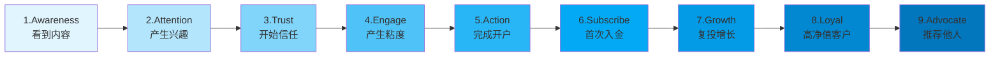

# 功能详细设计文档

## 模块1: 客户增长漏斗系统

### 1.1 ToFu（流量获取层）管理

#### 功能概述
管理从各渠道获取的潜在客户，追踪引流效果，优化获客成本。

#### 核心功能

**1.1.1 接粉数据录入**

- **手动录入**
  - 表单字段：客户昵称、来源渠道、联系方式、备注
  - 自动生成：客户ID、录入时间、负责员工
  - 支持批量导入（Excel/CSV）

- **自动抓取**（可选）
  - 企业微信API集成
  - WhatsApp Business API
  - Telegram Bot API
  - 自动同步新增好友

**1.1.2 渠道管理**

```javascript
// 渠道类型枚举
const CHANNELS = {
  SOCIAL_MEDIA: {
    TIKTOK: 'TikTok',
    FACEBOOK: 'Facebook',
    INSTAGRAM: 'Instagram',
    TWITTER: 'Twitter/X'
  },
  CONTENT: {
    YOUTUBE: 'YouTube',
    BLOG: '博客文章',
    PODCAST: '播客'
  },
  COMMUNITY: {
    FORUM: '财经论坛',
    WECHAT_GROUP: '微信群',
    TELEGRAM: 'Telegram群'
  },
  REFERRAL: {
    CUSTOMER: '客户推荐',
    PARTNER: '合作伙伴'
  },
  PAID: {
    GOOGLE_ADS: 'Google广告',
    FACEBOOK_ADS: 'Facebook广告',
    NATIVE_ADS: '原生广告'
  }
}
```

- 渠道效果分析
  - 各渠道接粉数对比
  - 留群率对比
  - 转化率对比
  - ROI计算（付费渠道）

**1.1.3 建群与留群管理**

- **群组管理**
  - 创建群组（美股群、BTC群、价值投资群等）
  - 群成员管理
  - 群消息模板
  - 欢迎语自动发送

- **留群追踪**
  - 记录客户是否留群
  - 留群时间统计
  - 留群率计算：`留群数 / 接粉数 × 100%`
  - 流失原因标记

**1.1.4 初筛系统**

> [!WARNING]
> **六类必须筛掉的客户**

自动/手动标记以下客户类型：
1. ❌ 军人
2. ❌ 残疾人
3. ❌ 律师
4. ❌ 卡车司机
5. ❌ 资金不足（<$2,500）
6. ❌ 色粉/不正经客户

- **筛选流程**
  ```
  客户信息录入 → 自动检测关键词 → 风险标记 → 人工确认 → 礼貌退出
  ```

- **退出话术模板**
  ```
  "您的情况我理解，但我这边的服务需要您具备一定的资金基础和时间精力，
  不然无法真正帮到您。我们保持联系，您未来条件合适了随时来找我。"
  ```

#### 数据看板

**ToFu仪表板包含：**
- 📊 今日/本周/本月接粉趋势图
- 📈 各渠道接粉占比饼图
- 📉 留群率折线图
- 🎯 员工接粉排行榜
- ⚠️ 低留群率预警

---

### 1.2 MoFu（客户培育层）管理

#### 功能概述
建立客户信任，提升粘度，引导客户从观望到行动。

#### 核心功能

**1.2.1 意向信号评分系统**

基于30项意向信号自动计算客户意向分数（0-60分）：

**一级强意向信号（3分/项）**
- ✅ 主动问框架
- ✅ 主动问"你怎么看？"
- ✅ 说自己想提升
- ✅ 说想赚钱但不知道怎么做
- ✅ 愿意执行任务
- ✅ 会反馈你的内容
- ✅ 会感谢/表达信任
- ✅ 主动问俱乐部
- ✅ 提到未来规划
- ✅ 有资金（≥$2,500）

**二级意向信号（2分/项）**
- 👍 喜欢你的生活方式
- 👍 喜欢你的价值观
- 👍 喜欢你的自律素材
- 👍 经常点赞/互动
- 👍 会问"你是做什么的"
- 👍 主动更新自己情况
- 👍 对朋友圈内容有共鸣
- 👍 会转发你的材料
- 👍 会问"能不能具体说说"
- 👍 问你时间安排

**三级意向信号（1分/项）**
- 💬 回答"嗯/OK"但持续在线
- 💬 一周内聊过3次以上
- 💬 会讲自己生活
- 💬 主动分享情绪
- 💬 会问"最近怎么样"
- 💬 有点依赖你
- 💬 聊天语气变轻松
- 💬 愿意听故事
- 💬 有跟票行为
- 💬 会问"要看什么/做什么"

**评分规则：**
```javascript
function calculateIntentionScore(signals) {
  let score = 0;
  signals.level1.forEach(() => score += 3);
  signals.level2.forEach(() => score += 2);
  signals.level3.forEach(() => score += 1);
  return Math.min(score, 60); // 最高60分
}

// 分级
if (score >= 40) return '高意向 - 立即推进开户';
if (score >= 25) return '中意向 - MoFu深耕';
return '低意向 - 自动化运营';
```

**1.2.2 粘度指数计算**

粘度指数（Engagement Score）= 综合评估客户关系质量

**计算维度：**
```javascript
const engagementScore = {
  responseSpeed: {
    weight: 0.15,
    calculate: (avgResponseTime) => {
      // <5分钟: 10分, 5-30分钟: 7分, 30-120分钟: 5分, >2小时: 2分
    }
  },
  responseLength: {
    weight: 0.10,
    calculate: (avgMessageLength) => {
      // >50字: 10分, 20-50字: 7分, <20字: 3分
    }
  },
  questionDepth: {
    weight: 0.20,
    calculate: (questionQuality) => {
      // 深度问题: 10分, 一般问题: 5分, 无问题: 0分
    }
  },
  emotionalReaction: {
    weight: 0.15,
    calculate: (sentiment) => {
      // 积极: 10分, 中性: 5分, 消极: 2分
    }
  },
  initiativeFrequency: {
    weight: 0.20,
    calculate: (initiativeChats) => {
      // 主动聊天频率
    }
  },
  taskCompletion: {
    weight: 0.20,
    calculate: (completionRate) => {
      // 任务完成率 × 10
    }
  }
};

// 总分 = Σ(维度分数 × 权重)
```

**粘度等级：**
- 🔥 90-100分：超强粘度（VIP潜力）
- ⭐ 70-89分：高粘度（重点培养）
- 👍 50-69分：中等粘度（持续互动）
- 😐 30-49分：低粘度（需加强）
- ⚠️ <30分：极低粘度（考虑筛掉）

**1.2.3 高质量对话追踪**

系统自动识别并标记"高质量对话"：

**判断标准：**
- ✅ 使用了反问技巧
- ✅ 客户有深度回应（>30字）
- ✅ 涉及框架/价值观讨论
- ✅ 客户表达信任/认可
- ✅ 推进了客户阶段

**对话质量评分：**
```
低质量（1-3分）：简单问答，无深度
中质量（4-6分）：有互动，有内容
高质量（7-10分）：深度链接，推进明显
```

**1.2.4 反问次数统计**

> [!TIP]
> **反问 = 高维沟通的核心能力**

系统自动统计员工的反问行为：

- 每日反问次数
- 反问质量评分
- 反问后客户反应
- 反问话术库调用记录

**反问类型分类：**
1. **重复问题型**："你是想要短线收益，还是想建立长期能力？"
2. **拆解问题型**："你是怕亏钱还是怕错过？"
3. **反向提问型**："你想靠运气赚钱，还是靠系统赚钱？"
4. **回到框架型**："真正的高手，只做自己理解的事情。"

**1.2.5 开户管理**

- **开户流程追踪**
  ```
  意向确认 → 资料准备 → 开户指导 → 账户激活 → 状态更新
  ```

- **开户数据**
  - 开户时间
  - 开户平台
  - 负责员工
  - 从接触到开户的天数
  - 开户转化率：`开户数 / 高意向客户数`

- **开户话术推荐**
  系统根据客户类型自动推荐最佳开户话术

**1.2.6 跟票管理**

- 记录客户是否跟随建议操作
- 跟票成功率统计
- 跟票客户标签
- 跟票到开户的转化追踪

#### MoFu仪表板

- 📊 意向分数分布图
- 📈 粘度指数趋势
- 🎯 高质量对话排行
- 📉 开户转化漏斗
- ⚡ 反问能力雷达图

---

### 1.3 BoFu（价值最大化层）管理

#### 功能概述
促成首次入金，提升客户LTV，降低出金率，培养VIP客户。

#### 核心功能

**1.3.1 入金管理系统**

**入金记录**
```javascript
const depositRecord = {
  id: 'DEP_20251130_001',
  customerId: 'CUST_12345',
  employeeId: 'EMP_001',
  amount: 5000,
  currency: 'USD',
  type: '首金', // 首金 | 复入金 | 大额入金
  platform: 'Interactive Brokers',
  timestamp: '2025-11-30T10:30:00Z',
  status: '已确认',
  notes: '客户对长期价值投资感兴趣'
};
```

**入金分类：**
- 💰 **首金**：客户第一次入金（关键转化节点）
- 💵 **复入金**：后续追加入金
- 💎 **大额入金**：单笔 ≥ $10,000

**入金统计：**
- 今日/本周/本月入金人数
- 入金金额汇总
- 平均入金金额
- 首金转化率：`首金人数 / 开户人数`

**1.3.2 出金管理与预警**

**出金记录**
```javascript
const withdrawalRecord = {
  id: 'WTH_20251130_001',
  customerId: 'CUST_12345',
  amount: 1000,
  currency: 'USD',
  reason: '部分盈利提现', // 盈利提现 | 恐慌离场 | 资金需求 | 其他
  riskLevel: '低', // 低 | 中 | 高
  timestamp: '2025-11-30T14:00:00Z',
  handledBy: 'EMP_001',
  retentionAction: '已沟通，客户保留剩余资金'
};
```

**出金率计算：**
```javascript
出金率 = (累计出金金额 / 累计入金金额) × 100%

// 健康标准
if (出金率 < 20%) return '健康';
if (出金率 < 30%) return '正常';
if (出金率 < 40%) return '需关注';
return '高风险';
```

**出金预警系统：**

触发预警条件：
1. 🚨 客户连续3天询问出金流程
2. 🚨 聊天中出现恐慌词汇（fear, loss, sell, exit）
3. 🚨 账户浮亏超过20%
4. 🚨 客户沉默超过7天（之前活跃）
5. 🚨 大盘暴跌期间的异常行为

**预警处理流程：**
```
系统检测风险 → 自动标记客户 → 推送给负责员工 
→ 推荐危机话术 → 员工主动沟通 → 记录处理结果
```

**危机话术示例：**
```
"我理解你会紧张，但我们现在要做的不是逃跑，而是结构化处理风险。
出金是情绪，调整结构才是方案。"
```

**1.3.3 净入金计算**

```javascript
净入金 = 总入金 - 总出金

// 员工绩效核心指标
const employeePerformance = {
  totalDeposit: 50000,
  totalWithdrawal: 8000,
  netDeposit: 42000, // 核心KPI
  withdrawalRate: 16% // 优秀
};
```

**1.3.4 大额客户管理**

**大额客户定义：**
- 💎 S级：累计入金 ≥ $50,000
- 💰 A级：累计入金 ≥ $10,000
- 💵 B级：累计入金 ≥ $5,000

**大额客户服务：**
- 专属客户经理
- VIP服务通道
- 定制化资产配置
- 优先出金处理
- 定期回访计划
- 风险监控加强

**大额客户雷达图：**
```
维度：
- 资金规模
- 活跃度
- 信任度
- 风险承受能力
- 长期潜力
- 推荐意愿
```

**1.3.5 客户LTV预测**

```javascript
// 客户生命周期价值预测
function predictLTV(customer) {
  const factors = {
    avgDepositAmount: customer.avgDeposit,
    depositFrequency: customer.depositCount / customer.monthsActive,
    withdrawalRate: customer.withdrawalRate,
    engagementScore: customer.engagementScore,
    intentionScore: customer.intentionScore
  };
  
  // 简化公式
  const monthlyValue = factors.avgDepositAmount * factors.depositFrequency * (1 - factors.withdrawalRate);
  const predictedLifespan = factors.engagementScore / 10; // 月数
  
  return monthlyValue * predictedLifespan;
}
```

#### BoFu仪表板

- 💰 今日/本周/本月净入金
- 📊 入金vs出金对比图
- 🎯 大额客户列表
- ⚠️ 出金风险预警
- 📈 LTV预测排行

---

## 模块2: CRM客户管理系统

### 2.1 360度客户画像

#### 基本信息
```javascript
const customerProfile = {
  // 基础信息
  id: 'CUST_12345',
  name: 'Jay Shah',
  avatar: 'https://...',
  gender: '男',
  age: 32,
  country: '阿联酋',
  city: '迪拜',
  timezone: 'UTC+4',
  language: ['英语', '印地语'],
  
  // 联系方式
  contact: {
    wechat: 'jayshah_dubai',
    whatsapp: '+971-xxx-xxxx',
    telegram: '@jayshah',
    email: 'jay@example.com'
  },
  
  // 职业信息
  occupation: {
    job: '固定工作',
    industry: '未知',
    income: '$2,500-$5,000/月'
  },
  
  // 投资背景
  investment: {
    experience: '中低',
    interests: ['美股', 'Day Trading', '短线交易'],
    riskPreference: '激进型',
    capitalRange: '$2,500-$10,000',
    tradingPlatform: 'Interactive Brokers'
  },
  
  // 兴趣爱好
  interests: [
    '每天步行30-45分钟',
    '迪拜生活',
    '海外文化',
    '俱乐部式社群'
  ],
  
  // 性格特质
  personality: {
    traits: ['礼貌', '被动', '执行力强', '依赖权威'],
    communication: '需要引导，不主动表达',
    decisionStyle: '依赖外部建议'
  }
};
```

### 2.2 智能标签系统

**标签分类：**

**1. 客户分层标签**
- 🏆 S级客户
- ⭐ A级客户
- 👍 B级客户
- 😐 C级客户

**2. 意向标签**
- 🔥 高意向
- 👀 中意向
- 😴 低意向
- ❌ 已筛掉

**3. 行为标签**
- 💬 高互动
- 📚 愿意学习
- ✅ 执行力强
- 🎯 有跟票
- 💰 已开户
- 💵 已入金

**4. 风险标签**
- ⚠️ 出金风险
- 🚨 情绪不稳
- ⏰ 长期沉默
- 📉 账户亏损

**5. 来源标签**
- 📱 TikTok
- 📘 Facebook
- 💬 Telegram群
- 👥 客户推荐

**6. 三类目标客户标签**
- 🌱 愿意成长
- 💪 愿意负责
- 🚀 拥抱未来

**7. 黑名单标签**
- ❌ 军人
- ❌ 律师
- ❌ 资金不足
- ❌ 色粉

**标签自动化规则：**
```javascript
// 示例：自动打标签
if (customer.intentionScore >= 40) {
  addTag(customer, '高意向');
}

if (customer.depositCount > 0) {
  addTag(customer, '已入金');
}

if (customer.engagementScore >= 70) {
  addTag(customer, '高互动');
}

if (customer.withdrawalRisk > 0.7) {
  addTag(customer, '出金风险');
  notifyEmployee(customer.assignedTo, '客户出金风险预警');
}
```

### 2.3 客户旅程可视化

**9阶段旅程图：**



**每个阶段的关键指标：**

| 阶段 | 关键行为 | 停留时间 | 转化率 | 下一步动作 |
|------|---------|---------|--------|-----------|
| Awareness | 看到朋友圈/内容 | 1-3天 | - | 吸引关注 |
| Attention | 加好友/进群 | 3-7天 | 40% | 建立初步信任 |
| Trust | 开始互动 | 7-14天 | 60% | 深化粘度 |
| Engage | 高质量对话 | 14-21天 | 50% | 引导开户 |
| Action | 完成开户 | 21-30天 | 30% | 首金引导 |
| Subscribe | 首次入金 | 30-45天 | 70% | 陪跑服务 |
| Growth | 复投 | 45-90天 | 40% | 提升金额 |
| Loyal | 大额客户 | 90+天 | 20% | VIP服务 |
| Advocate | 推荐他人 | 持续 | 10% | 裂变增长 |

**旅程可视化界面：**
- 时间轴展示
- 当前阶段高亮
- 关键事件标记
- 停滞预警
- 下一步建议

### 2.4 聊天记录管理

**功能需求：**

1. **记录存储**
   - 支持文字、图片、语音、视频
   - 自动同步企业微信/WhatsApp/Telegram
   - 云端存储，永久保存
   - 全文搜索

2. **智能分析**
   - 情绪分析（积极/中性/消极）
   - 关键词提取
   - 意向信号自动识别
   - 风险词汇预警

3. **快捷功能**
   - 重要对话标记
   - 待办事项提取
   - 话术调用记录
   - 反问次数统计

4. **隐私保护**
   - 权限控制（只能看自己的客户）
   - 敏感信息脱敏
   - 数据加密存储

**聊天记录界面示例：**
```
┌─────────────────────────────────────┐
│ 客户：Jay Shah                      │
│ 最后联系：2小时前                   │
│ 意向分数：42分 ↑                    │
│ 粘度指数：68分 →                    │
├─────────────────────────────────────┤
│ [2025-11-30 10:30] 客户             │
│ 我想了解短线交易的机会               │
│                                     │
│ [2025-11-30 10:32] 你（员工）       │
│ 你是想要快速收益，还是想建立        │
│ 一个长期能复用的交易系统？          │
│ 🏷️ 反问 | 💡 意向信号+2             │
│                                     │
│ [2025-11-30 10:35] 客户             │
│ 我想两者都有，但更想学习系统        │
│ 🔥 高质量回应 | 💡 意向信号+3        │
│                                     │
│ [2025-11-30 10:37] 你（员工）       │
│ 你这种愿意学习的态度非常好。        │
│ 我们可以从一个简单的框架开始...    │
│ 🏷️ 镜像+框架                        │
└─────────────────────────────────────┘
```

### 2.5 下一步动作推荐（AI驱动）

**推荐引擎逻辑：**

```javascript
function recommendNextAction(customer) {
  const { stage, intentionScore, engagementScore, lastContactDays } = customer;
  
  // 规则引擎
  if (lastContactDays > 7) {
    return {
      action: '主动联系',
      priority: '高',
      script: '关怀话术模板',
      reason: '客户已7天未联系，需主动激活'
    };
  }
  
  if (stage === 'Engage' && intentionScore >= 40) {
    return {
      action: '引导开户',
      priority: '高',
      script: '开户话术链路',
      reason: '客户意向分数达到40分，可推进开户'
    };
  }
  
  if (stage === 'Action' && engagementScore >= 60) {
    return {
      action: '首金引导',
      priority: '中',
      script: '首金话术链路',
      reason: '客户已开户且粘度良好，可尝试首金'
    };
  }
  
  if (customer.withdrawalRisk > 0.7) {
    return {
      action: '危机处理',
      priority: '紧急',
      script: '出金危机话术',
      reason: '客户出金风险高，需立即沟通'
    };
  }
  
  // 默认建议
  return {
    action: '日常互动',
    priority: '低',
    script: '粘度建立话术',
    reason: '保持日常联系，提升粘度'
  };
}
```

**推荐界面：**
```
┌─────────────────────────────────────┐
│ 🎯 推荐下一步动作                   │
├─────────────────────────────────────┤
│ 优先级：🔴 高                        │
│ 动作：引导开户                       │
│ 原因：客户意向分数42分，粘度68分    │
│       已具备开户条件                 │
│                                     │
│ 📝 推荐话术：                        │
│ "我们可以从一个没有压力的起点开始， │
│  先开户，你的学习会从那一刻真正开始。"│
│                                     │
│ [使用此话术] [查看完整链路] [忽略]   │
└─────────────────────────────────────┘
```

---

## 模块3: 话术与素材库

### 3.1 话术库系统

#### 3.1.1 话术分类结构

```
话术库/
├── 12大模型话术/
│   ├── 1.镜像共鸣
│   ├── 2.身份提升
│   ├── 3.反问领跑
│   ├── 4.洞察模型
│   ├── 5.框架模型
│   ├── 6.结构化解释
│   ├── 7.情绪链接
│   ├── 8.价值观链接
│   ├── 9.未来锚定
│   ├── 10.可视化成长
│   ├── 11.意义附着
│   └── 12.行动启动
│
├── 四大黄金链路/
│   ├── 反问链路
│   ├── 粘度链路
│   ├── 转化链路（开户）
│   └── 首金链路
│
├── 场景话术/
│   ├── ToFu场景/
│   │   ├── 初次接触
│   │   ├── 建群欢迎
│   │   └── 初步筛选
│   ├── MoFu场景/
│   │   ├── 日常互动
│   │   ├── 深度对话
│   │   ├── 框架输出
│   │   └── 开户引导
│   └── BoFu场景/
│       ├── 首金引导
│       ├── 复入金
│       ├── 大额服务
│       └── 出金危机
│
├── 客户类型话术/
│   ├── 三类目标客户/
│   │   ├── 愿意成长型
│   │   ├── 愿意负责型
│   │   └── 拥抱未来型
│   └── 特殊客户/
│       ├── 被动型
│       ├── 激进型
│       ├── 犹豫型
│       └── VIP客户
│
└── 风控话术/
    ├── 合规提示
    ├── 风险警示
    └── 危机处理
```

#### 3.1.2 话术数据结构

```javascript
const scriptTemplate = {
  id: 'SCRIPT_001',
  category: '反问链路',
  scenario: '客户问"买什么股票"',
  level: '中级',
  
  content: {
    chinese: '你是想要一个具体的股票代码，还是想学会如何自己判断？',
    english: 'Do you want a specific stock code, or do you want to learn how to judge by yourself?'
  },
  
  purpose: '从低维问题引导到高维思考',
  
  followUp: [
    {
      customerResponse: '我想要代码',
      nextScript: 'SCRIPT_002',
      note: '客户仍处于低维，需继续引导'
    },
    {
      customerResponse: '我想学习判断',
      nextScript: 'SCRIPT_003',
      note: '客户进入高维，可输出框架'
    }
  ],
  
  tags: ['反问', 'MoFu', '框架引导'],
  successRate: 0.78,
  usageCount: 1250,
  avgRating: 4.5,
  
  createdBy: 'EMP_001',
  createdAt: '2025-01-15',
  lastUpdated: '2025-11-20'
};
```

#### 3.1.3 智能话术推荐

**推荐算法：**

```javascript
function recommendScript(context) {
  const {
    customerMessage,
    customerProfile,
    conversationHistory,
    currentStage
  } = context;
  
  // 1. 关键词匹配
  const keywords = extractKeywords(customerMessage);
  let candidates = searchScriptsByKeywords(keywords);
  
  // 2. 场景匹配
  candidates = candidates.filter(script => 
    script.scenario.includes(currentStage)
  );
  
  // 3. 客户类型匹配
  candidates = candidates.filter(script =>
    script.suitableFor.includes(customerProfile.persona)
  );
  
  // 4. 成功率排序
  candidates.sort((a, b) => b.successRate - a.successRate);
  
  // 5. 返回Top 3
  return candidates.slice(0, 3);
}
```

**推荐界面：**
```
┌─────────────────────────────────────┐
│ 💬 客户说：                          │
│ "我想知道现在买什么股票好？"         │
│                                     │
│ 🤖 推荐话术（3条）：                 │
│                                     │
│ 1️⃣ [反问链路] 成功率78%             │
│ "你是想要一个具体的股票代码，        │
│  还是想学会如何自己判断？"           │
│ [使用] [查看详情]                    │
│                                     │
│ 2️⃣ [框架模型] 成功率72%             │
│ "选股不是选代码，而是选逻辑。        │
│  我给你三个判断维度..."              │
│ [使用] [查看详情]                    │
│                                     │
│ 3️⃣ [洞察模型] 成功率68%             │
│ "大部分人问'买什么'，但真正赚钱的人  │
│  问'怎么建立系统'。"                 │
│ [使用] [查看详情]                    │
└─────────────────────────────────────┘
```

### 3.2 素材库系统

#### 3.2.1 素材分类

**1. 生活自律素材**
- 🏃 运动健身（跑步、健身房、瑜伽）
- 📚 阅读学习（书籍、笔记、课程）
- 🍎 健康饮食（早餐、健康餐）
- 🧘 自律习惯（早起、冥想、复盘）
- 🌅 生活美学（咖啡、风景、极简）

**2. 专业投资素材**
- 📊 市场分析（晨报、盘中、复盘）
- 📈 框架模型（三点式、结构图）
- 💡 投资洞察（观点、思考）
- 📉 风险提示（市场风险、操作建议）
- 🎓 知识分享（投资理念、策略）

**3. 心智价值观素材**
- 💪 成长心态
- 🎯 责任意识
- 🚀 未来愿景
- 🧠 认知升级
- ⚡ 执行力

**4. 俱乐部文化素材**
- 📅 年度复盘牌
- 👥 成员故事
- 🏆 成就展示
- 🎉 活动回顾
- 💬 价值观传递

**5. 节日场景素材**
- 🎊 新年规划
- 🎄 节日祝福
- 📆 周末总结
- 🌙 月度复盘

#### 3.2.2 素材数据结构

```javascript
const materialItem = {
  id: 'MAT_001',
  type: '图片', // 图片 | 视频 | 文字 | 图文
  category: '生活自律',
  subcategory: '运动健身',
  
  content: {
    image: 'https://cdn.example.com/running.jpg',
    caption: '今天也完成了10公里。坚持不是一件很酷的事，是一件很安静的事。',
    hashtags: ['#自律', '#跑步', '#成长']
  },
  
  purpose: '建立人格重量，让客户觉得值得跟',
  suitableStage: ['ToFu', 'MoFu'],
  
  engagement: {
    views: 1500,
    likes: 230,
    comments: 45,
    shares: 12
  },
  
  tags: ['运动', '自律', '粘度建立'],
  createdAt: '2025-11-25',
  publishedCount: 8
};
```

#### 3.2.3 素材发布系统

**功能：**
- 📱 一键发布到朋友圈
- 🕒 定时发布
- 📊 效果追踪
- 🔄 素材轮换
- 📝 文案模板

**发布规则建议：**
```
每日发布计划：
- 早上8:00：生活自律素材（早餐/晨跑）
- 中午12:00：专业内容（市场观点）
- 晚上20:00：心智/价值观素材

每周节奏：
- 周一：激励/目标
- 周二-周四：专业内容
- 周五：复盘/总结
- 周末：生活/放松
```

---

*由于篇幅限制，本文档将继续在下一个文件中...*

**下一部分将包含：**
- 模块4: 员工运营系统
- 模块5: 培训与考核系统
- 模块6: SOP执行引擎
- 模块7-9: 数据、风控、协作系统

---

**文档版本**: v1.0  
**创建日期**: 2025-11-30  
**状态**: ✅ 第一部分完成
