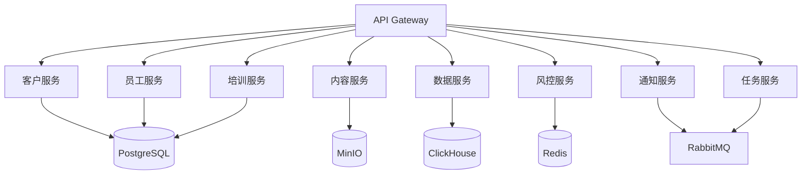
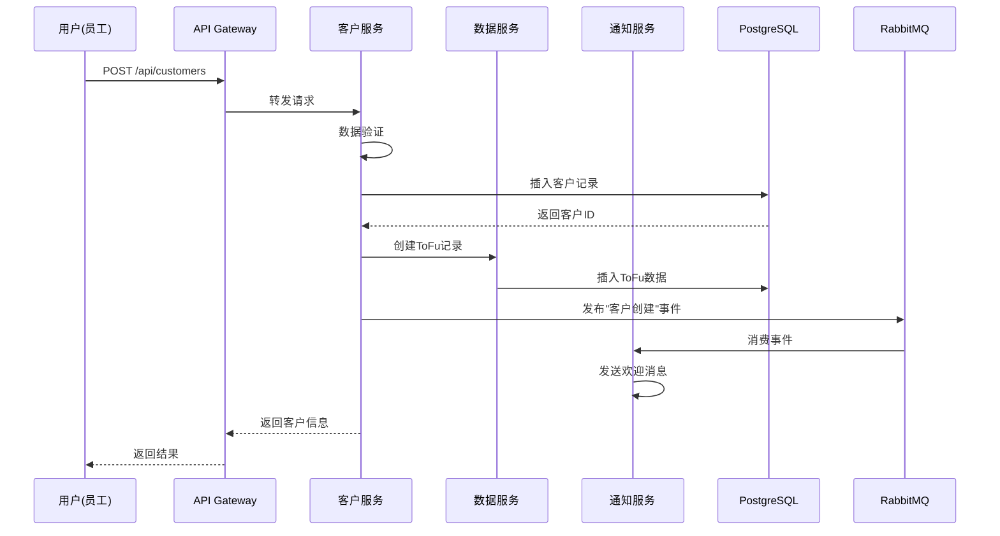
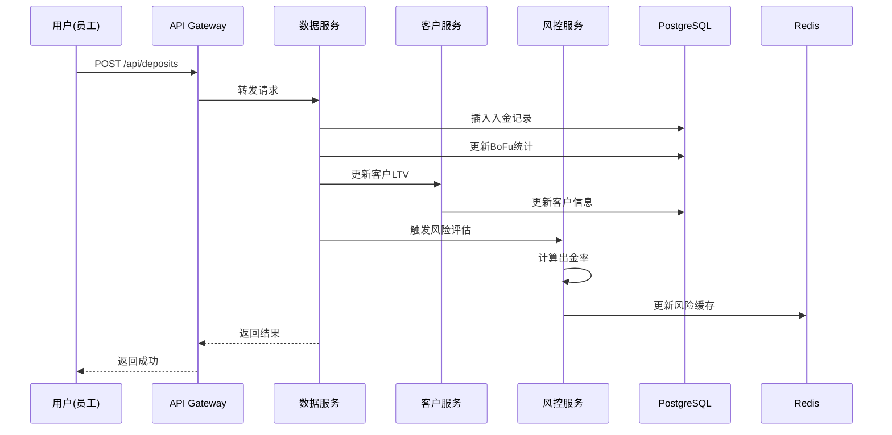
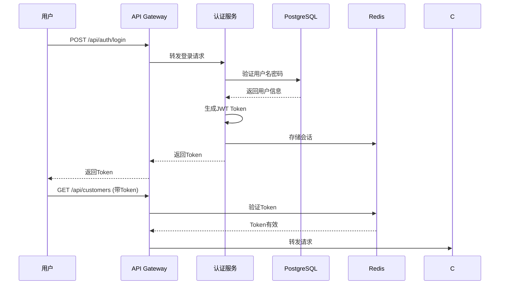

# 技术架构设计文档

## 1. 系统架构总览

### 1.1 整体架构图

```
┌──────────────────────────────────────────────────────────────┐
│                        用户层                                 │
│  ┌──────────┐  ┌──────────┐  ┌──────────┐  ┌──────────┐    │
│  │ Web后台  │  │ 移动App  │  │ 小程序   │  │ H5页面   │    │
│  └──────────┘  └──────────┘  └──────────┘  └──────────┘    │
└──────────────────────────────────────────────────────────────┘
                            ↓
┌──────────────────────────────────────────────────────────────┐
│                      API网关层                                │
│  ┌────────────────────────────────────────────────────────┐  │
│  │  Nginx / Kong API Gateway                             │  │
│  │  - 路由转发  - 负载均衡  - 限流  - 认证  - 日志      │  │
│  └────────────────────────────────────────────────────────┘  │
└──────────────────────────────────────────────────────────────┘
                            ↓
┌──────────────────────────────────────────────────────────────┐
│                      应用服务层                               │
│  ┌──────────┐  ┌──────────┐  ┌──────────┐  ┌──────────┐    │
│  │ 客户服务 │  │ 员工服务 │  │ 内容服务 │  │ 数据服务 │    │
│  └──────────┘  └──────────┘  └──────────┘  └──────────┘    │
│  ┌──────────┐  ┌──────────┐  ┌──────────┐  ┌──────────┐    │
│  │ 培训服务 │  │ 风控服务 │  │ 通知服务 │  │ 任务服务 │    │
│  └──────────┘  └──────────┘  └──────────┘  └──────────┘    │
└──────────────────────────────────────────────────────────────┘
                            ↓
┌──────────────────────────────────────────────────────────────┐
│                      中间件层                                 │
│  ┌──────────┐  ┌──────────┐  ┌──────────┐  ┌──────────┐    │
│  │  Redis   │  │RabbitMQ  │  │  MinIO   │  │  Consul  │    │
│  │  缓存    │  │ 消息队列 │  │ 对象存储 │  │ 服务发现 │    │
│  └──────────┘  └──────────┘  └──────────┘  └──────────┘    │
└──────────────────────────────────────────────────────────────┘
                            ↓
┌──────────────────────────────────────────────────────────────┐
│                      数据层                                   │
│  ┌──────────┐  ┌──────────┐  ┌──────────┐  ┌──────────┐    │
│  │PostgreSQL│  │ElasticSea│  │ClickHouse│  │  MongoDB │    │
│  │  主数据库│  │  搜索引擎│  │ 分析数据库│  │  日志库  │    │
│  └──────────┘  └──────────┘  └──────────┘  └──────────┘    │
└──────────────────────────────────────────────────────────────┘
                            ↓
┌──────────────────────────────────────────────────────────────┐
│                      基础设施层                               │
│  ┌────────────────────────────────────────────────────────┐  │
│  │  Docker + Kubernetes / Docker Compose                 │  │
│  │  监控: Prometheus + Grafana                           │  │
│  │  日志: ELK Stack (Elasticsearch + Logstash + Kibana) │  │
│  │  CI/CD: GitHub Actions / GitLab CI                   │  │
│  └────────────────────────────────────────────────────────┘  │
└──────────────────────────────────────────────────────────────┘
```

### 1.2 技术栈选型

#### 前端技术栈

| 层级 | 技术选型 | 说明 |
|-----|---------|------|
| **Web后台** | React 18 + Next.js 14 | 服务端渲染，SEO友好 |
| **UI框架** | Ant Design 5 / Material-UI | 企业级组件库 |
| **状态管理** | Zustand / Redux Toolkit | 轻量级状态管理 |
| **图表库** | ECharts 5 / Recharts | 数据可视化 |
| **表格** | AG-Grid / TanStack Table | 高性能表格 |
| **移动端** | React Native / UniApp | 跨平台开发 |
| **小程序** | UniApp / Taro | 多端统一 |
| **CSS方案** | Tailwind CSS / CSS Modules | 原子化CSS |
| **构建工具** | Vite / Turbopack | 快速构建 |

#### 后端技术栈

| 层级 | 技术选型 | 说明 |
|-----|---------|------|
| **运行时** | Node.js 20 LTS | 高性能异步I/O |
| **框架** | NestJS / Express | 企业级框架 |
| **语言** | TypeScript 5 | 类型安全 |
| **ORM** | Prisma / TypeORM | 数据库ORM |
| **API文档** | Swagger / OpenAPI | 自动生成文档 |
| **认证** | JWT + Passport.js | 身份认证 |
| **验证** | Zod / Joi | 数据验证 |
| **定时任务** | node-cron / Bull | 任务调度 |

**备选方案（Java栈）：**
- Spring Boot 3 + Spring Cloud
- MyBatis-Plus
- Spring Security + OAuth2

#### 数据库技术栈

| 类型 | 技术选型 | 用途 |
|-----|---------|------|
| **关系型数据库** | PostgreSQL 14+ | 主数据存储 |
| **缓存** | Redis 7+ | 会话、热数据 |
| **搜索引擎** | ElasticSearch 8+ | 全文搜索 |
| **分析数据库** | ClickHouse | 大数据分析 |
| **文档数据库** | MongoDB | 日志、非结构化数据 |
| **对象存储** | MinIO / AWS S3 | 文件存储 |

#### 中间件技术栈

| 类型 | 技术选型 | 用途 |
|-----|---------|------|
| **消息队列** | RabbitMQ / Kafka | 异步任务、事件驱动 |
| **服务发现** | Consul / Nacos | 微服务注册 |
| **API网关** | Kong / Nginx | 统一入口 |
| **配置中心** | Consul / Apollo | 配置管理 |

#### DevOps技术栈

| 类型 | 技术选型 | 用途 |
|-----|---------|------|
| **容器化** | Docker | 应用容器化 |
| **编排** | Kubernetes / Docker Compose | 容器编排 |
| **CI/CD** | GitHub Actions / GitLab CI | 持续集成部署 |
| **监控** | Prometheus + Grafana | 性能监控 |
| **日志** | ELK Stack | 日志收集分析 |
| **追踪** | Jaeger / Zipkin | 分布式追踪 |

## 2. 微服务架构设计

### 2.1 服务拆分



### 2.2 服务详细说明

#### 2.2.1 客户服务 (Customer Service)

**职责：**
- 客户CRUD操作
- 客户画像管理
- 客户标签管理
- 客户旅程追踪
- 意向评分计算
- 粘度指数计算

**API端点：**
```
POST   /api/customers              创建客户
GET    /api/customers/:id          获取客户详情
PUT    /api/customers/:id          更新客户信息
DELETE /api/customers/:id          删除客户
GET    /api/customers              客户列表（分页、筛选）
POST   /api/customers/:id/tags     添加标签
GET    /api/customers/:id/journey  客户旅程
POST   /api/customers/:id/score    更新评分
```

**数据库表：**
- customers
- customer_tags
- customer_journey
- tags

#### 2.2.2 员工服务 (Employee Service)

**职责：**
- 员工管理
- 权限控制
- KPI统计
- 绩效评估
- 任务分配

**API端点：**
```
POST   /api/employees              创建员工
GET    /api/employees/:id          员工详情
PUT    /api/employees/:id          更新员工
GET    /api/employees/:id/kpis     员工KPI
GET    /api/employees/:id/customers 负责客户列表
POST   /api/employees/:id/assign   分配客户
```

**数据库表：**
- employees
- employee_kpis
- roles
- permissions

#### 2.2.3 内容服务 (Content Service)

**职责：**
- 话术库管理
- 素材库管理
- SOP引擎
- 智能推荐

**API端点：**
```
GET    /api/scripts                话术列表
GET    /api/scripts/recommend      推荐话术
POST   /api/scripts                创建话术
GET    /api/materials              素材列表
POST   /api/materials/publish      发布素材
GET    /api/sop/next-action        推荐下一步动作
```

**数据库表：**
- scripts
- materials
- sop_rules

#### 2.2.4 数据服务 (Data Service)

**职责：**
- 漏斗数据管理
- 入金出金记录
- 对话记录
- 数据统计分析
- 报表生成

**API端点：**
```
POST   /api/funnel/tofu            记录ToFu数据
POST   /api/funnel/mofu            记录MoFu数据
POST   /api/funnel/bofu            记录BoFu数据
POST   /api/deposits               记录入金
POST   /api/withdrawals            记录出金
GET    /api/reports/daily          每日报表
GET    /api/reports/dashboard      仪表板数据
```

**数据库表：**
- funnel_tofu
- funnel_mofu
- funnel_bofu
- deposits
- withdrawals
- conversations

#### 2.2.5 培训服务 (Training Service)

**职责：**
- 课程管理
- 培训进度追踪
- 考试系统
- 证书颁发

**API端点：**
```
GET    /api/courses                课程列表
GET    /api/courses/:id            课程详情
POST   /api/courses/:id/enroll     报名课程
PUT    /api/courses/:id/progress   更新进度
POST   /api/exams                  提交考试
GET    /api/certificates           我的证书
```

#### 2.2.6 风控服务 (Risk Service)

**职责：**
- 出金风险评估
- 情绪监控
- 异常行为检测
- 预警通知

**API端点：**
```
POST   /api/risk/evaluate          风险评估
GET    /api/risk/alerts            风险预警列表
POST   /api/risk/handle            处理风险
GET    /api/risk/customers         高风险客户
```

#### 2.2.7 通知服务 (Notification Service)

**职责：**
- 消息推送
- 邮件发送
- 短信发送
- 站内信

**API端点：**
```
POST   /api/notifications/push     推送通知
POST   /api/notifications/email    发送邮件
POST   /api/notifications/sms      发送短信
GET    /api/notifications          通知列表
```

#### 2.2.8 任务服务 (Task Service)

**职责：**
- 定时任务
- 异步任务
- 任务调度

**功能：**
- 每日KPI统计
- 每日报表生成
- 客户评分更新
- 风险扫描

## 3. 数据流设计

### 3.1 客户创建流程



### 3.2 入金记录流程



## 4. 缓存策略

### 4.1 Redis缓存设计

**缓存层级：**

```
L1: 应用内存缓存 (Node.js内存)
  ↓ miss
L2: Redis缓存
  ↓ miss
L3: 数据库
```

**缓存内容：**

| 数据类型 | 缓存Key | TTL | 说明 |
|---------|---------|-----|------|
| 用户会话 | `session:{token}` | 24h | JWT会话 |
| 客户画像 | `customer:{id}` | 1h | 热点客户 |
| 员工KPI | `kpi:employee:{id}:{date}` | 6h | 当日KPI |
| 话术推荐 | `script:recommend:{scenario}` | 30m | 推荐结果 |
| 仪表板数据 | `dashboard:{type}:{date}` | 15m | 实时数据 |
| 风险评分 | `risk:customer:{id}` | 2h | 风险缓存 |

**缓存更新策略：**
- **Cache Aside**: 读时缓存，写时失效
- **Write Through**: 写入数据库同时更新缓存
- **Write Behind**: 异步写入数据库

## 5. 安全设计

### 5.1 认证与授权

**认证流程：**



**权限模型 (RBAC)：**

```
角色 (Roles)
  ├── 管理员 (Admin)
  ├── 主管 (Manager)
  ├── 员工 (Employee)
  ├── 培训师 (Trainer)
  └── 数据分析师 (Analyst)

权限 (Permissions)
  ├── customer:read
  ├── customer:write
  ├── customer:delete
  ├── employee:manage
  ├── data:view_all
  └── ...
```

### 5.2 数据安全

- **传输加密**: HTTPS (TLS 1.3)
- **存储加密**: 敏感字段AES-256加密
- **密码存储**: bcrypt哈希 (cost=12)
- **SQL注入防护**: 参数化查询
- **XSS防护**: 输入验证 + 输出转义
- **CSRF防护**: CSRF Token

## 6. 性能优化

### 6.1 数据库优化

- **索引优化**: 为高频查询字段建立索引
- **分区表**: 按时间分区大表
- **读写分离**: 主从复制
- **连接池**: 限制并发连接数
- **慢查询监控**: 记录>100ms的查询

### 6.2 应用层优化

- **异步处理**: 耗时操作放入消息队列
- **批量操作**: 减少数据库往返次数
- **分页查询**: 避免一次性加载大量数据
- **CDN加速**: 静态资源使用CDN
- **Gzip压缩**: 压缩HTTP响应

### 6.3 前端优化

- **代码分割**: 按路由懒加载
- **图片优化**: WebP格式 + 懒加载
- **虚拟滚动**: 大列表使用虚拟滚动
- **防抖节流**: 高频操作限流
- **Service Worker**: 离线缓存

## 7. 监控与日志

### 7.1 监控指标

**系统指标：**
- CPU使用率
- 内存使用率
- 磁盘I/O
- 网络流量

**应用指标：**
- API响应时间
- 错误率
- QPS (每秒请求数)
- 数据库连接数

**业务指标：**
- 每日新增客户数
- 转化率
- 净入金
- 活跃用户数

### 7.2 日志系统

**日志级别：**
- ERROR: 错误日志
- WARN: 警告日志
- INFO: 信息日志
- DEBUG: 调试日志

**日志格式：**
```json
{
  "timestamp": "2025-11-30T10:30:00Z",
  "level": "INFO",
  "service": "customer-service",
  "traceId": "abc123",
  "userId": "EMP_001",
  "message": "Customer created",
  "data": {
    "customerId": "CUST_12345"
  }
}
```

## 8. 部署架构

### 8.1 Docker Compose部署（开发/测试环境）

```yaml
version: '3.8'

services:
  # API Gateway
  nginx:
    image: nginx:alpine
    ports:
      - "80:80"
      - "443:443"
    volumes:
      - ./nginx.conf:/etc/nginx/nginx.conf
  
  # 应用服务
  app:
    build: ./backend
    replicas: 3
    environment:
      - NODE_ENV=production
      - DATABASE_URL=postgresql://...
      - REDIS_URL=redis://redis:6379
  
  # PostgreSQL
  postgres:
    image: postgres:14
    volumes:
      - postgres_data:/var/lib/postgresql/data
    environment:
      - POSTGRES_PASSWORD=secret
  
  # Redis
  redis:
    image: redis:7-alpine
    volumes:
      - redis_data:/data
  
  # RabbitMQ
  rabbitmq:
    image: rabbitmq:3-management
    ports:
      - "15672:15672"
  
  # ElasticSearch
  elasticsearch:
    image: elasticsearch:8.11.0
    environment:
      - discovery.type=single-node
  
  # Grafana
  grafana:
    image: grafana/grafana
    ports:
      - "3000:3000"

volumes:
  postgres_data:
  redis_data:
```

### 8.2 Kubernetes部署（生产环境）

```yaml
apiVersion: apps/v1
kind: Deployment
metadata:
  name: crm-api
spec:
  replicas: 5
  selector:
    matchLabels:
      app: crm-api
  template:
    metadata:
      labels:
        app: crm-api
    spec:
      containers:
      - name: api
        image: crm-api:latest
        ports:
        - containerPort: 3000
        env:
        - name: DATABASE_URL
          valueFrom:
            secretKeyRef:
              name: db-secret
              key: url
        resources:
          requests:
            memory: "256Mi"
            cpu: "250m"
          limits:
            memory: "512Mi"
            cpu: "500m"
        livenessProbe:
          httpGet:
            path: /health
            port: 3000
          initialDelaySeconds: 30
          periodSeconds: 10
```

## 9. 灾备方案

### 9.1 数据备份

- **全量备份**: 每天凌晨3点
- **增量备份**: 每6小时
- **备份保留**: 30天
- **异地备份**: 云存储

### 9.2 高可用

- **应用层**: 多实例部署 + 负载均衡
- **数据库**: 主从复制 + 自动故障转移
- **缓存**: Redis Sentinel / Cluster
- **消息队列**: RabbitMQ集群

---

**文档版本**: v1.0  
**创建日期**: 2025-11-30  
**状态**: ✅ 已完成
